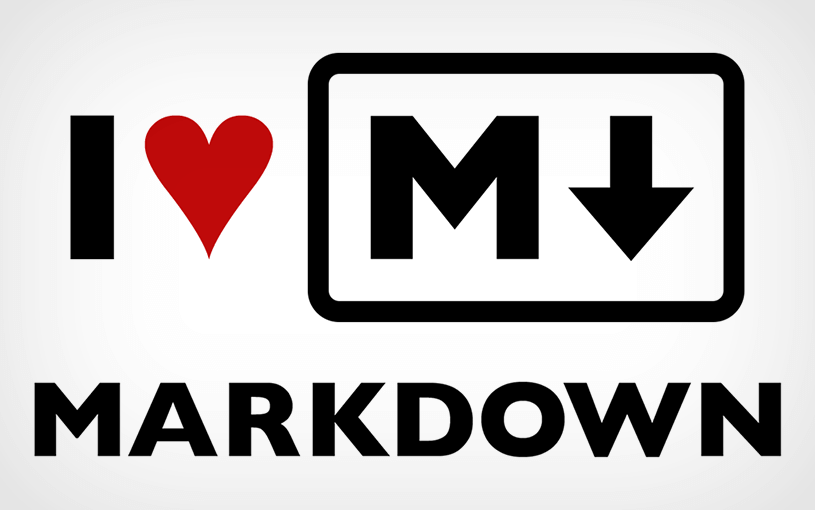

# Atividade Mardown

## O que é o Markdown?

**Markdown** é uma _linguagem de marcação_ que pode ser convertida para HTML. 
É bem simples de aprender, pois sua leitura e escrita são muito fáceis. 
Markdown é muito utilizada em documentação de software e é a linguagem oficial de documentação no GitHub.

## Onde utilizar?

Existem vários lugares que você pode usar Markdown: No Github mesmo, você pode usar no READ, que é um arquivo que fica na raiz do seu projeto, e é renderizado pelo Github abaixo da lista de arquivos. Aquele texto que você lê quando acessa um repositório é um arquivo README, escrito em Markdown.  
Ainda no Github, você pode usar Markdown no texto das issues, no texto de um pull request e na wiki.

## Algumas estrututas do Markdown

# Títulos 

## Título 1  
### Título 2  
#### Titulo 3
##### Título 4
###### Título 5

# Enfâse nas palavras

## Negrito

**Lorem Ipsum** **Lorem Ipsum** **Lorem Ipsum** **Lorem Ipsum** **Lorem Ipsum** 

## Itálico

_Lorem Ipsum_ _Lorem Ipsum_ _Lorem Ipsum_ _Lorem Ipsum_ _Lorem Ipsum_ 

## Riscado

~~Lorem Ipsum~~ ~~Lorem Ipsum~~ ~~Lorem Ipsum~~ ~~Lorem Ipsum~~ ~~Lorem Ipsum~~  
  

# Citações

> Lorem ipsum, Lorem Ipsum

# Listas não ordenadas

* Item
* Item
* Item

# Listas ordenadas

1. Item
2. Item
3. Item

# Links

[Clique aqui](https://github.com/)

# Imagens 



# Tabelas

| Nome | Idade | País |
| :---:  | :-----: | :----: |
| Gustavo Brandão | 17 | Brasil |
| João | 22 | USA
| etc | etc | etc |

# Códigos

```html

<!-- Exemplo HTML !-->

Para criar uma página em html, você precisa utilizar <html>, <head> e <body>
Atráves destas 3 tags
Outros exemplos de tags: <p>, <div>, <header>, etc

```
## Exemplo 2 - códigos

Para prosseguir, informe o seu `e-mail` e sua `senha`.


